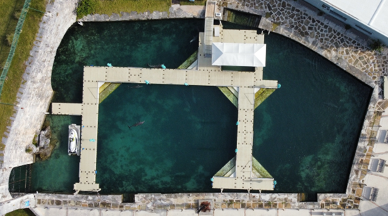
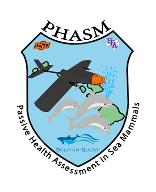
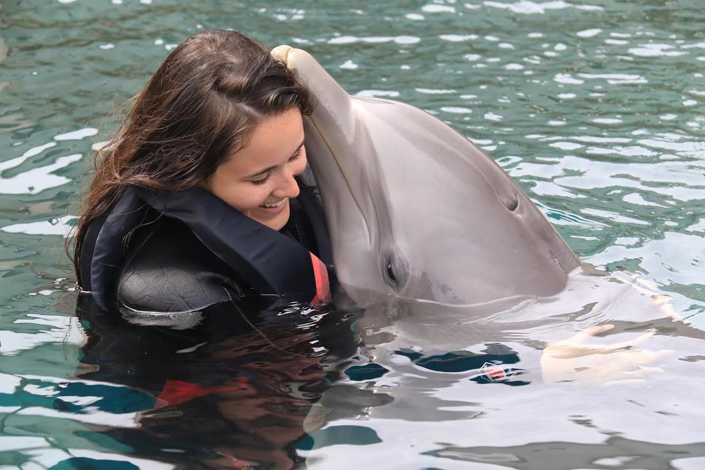
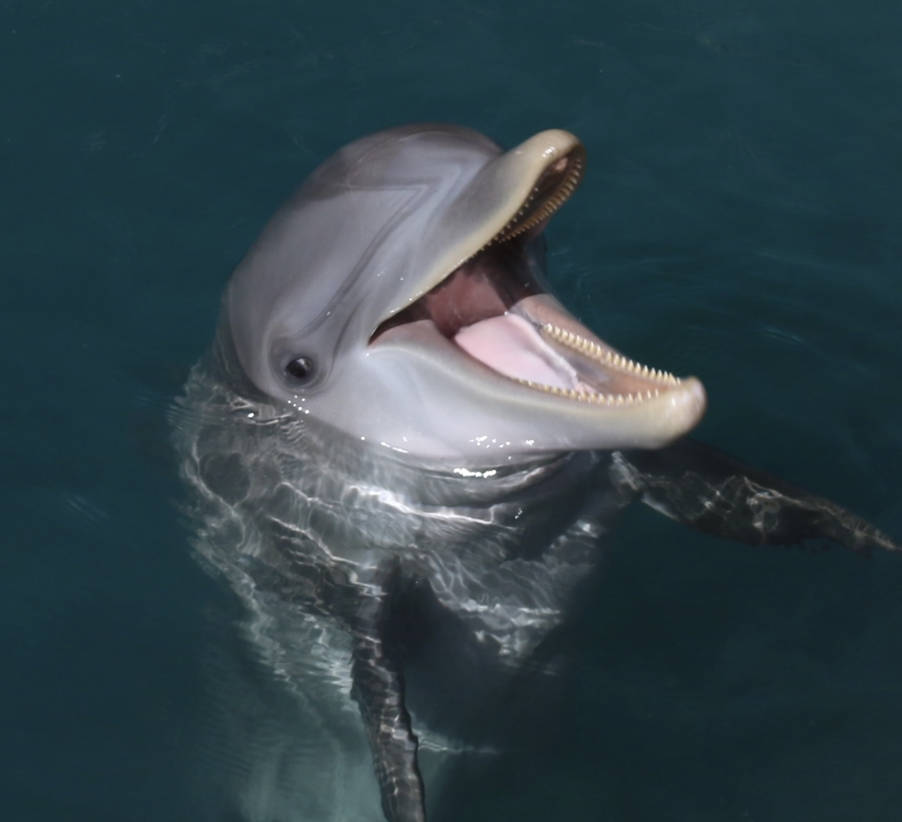

```{r setup, include=FALSE}
knitr::opts_chunk$set(warning = FALSE, 
                      message = FALSE,
                       fig.path = "../Output/")
options(htmltools.dir.version = FALSE)
```

# Project Background

- M.Sc. Thesis Project 

- Dolphin Quest Bermuda

- Thesis Project Objectives
  - Determine response levels of bottlenose dolphins to seven UAS (uncrewed aerial system) types at various heights over multiple sessions.
  - Aid in the development of a new UAS passive health monitoring system with wild cetaceans. 
  
<div style="text-align: center;">
  
  
</div>
---
## Load Libraries

```{r}
library(here)            # manage file paths
library(tidyverse)       # data manipulation 
library(xaringan)        # create presentations 
library(leaflet)         # creating interactive maps
library(lubridate)       # dates and time management 
library(MetBrewer)       # to add colors
library(kableExtra)      # table generation 
library(gganimate)       # plot animation 
library(ggimage)         # allows you to display images within plots
library(htmlwidgets)     # to upload my leaflet graph to output
```

## Load Data

```{r}

StartData <- read.csv(here("FinalProject", "Data", "DQB_2022_2023_SD_Data.csv" ))

DolphData <- read.csv(here("FinalProject", "Data", "DQB_2022_2023_SD_Data.csv" ))

dtable <- read.csv(here("FinalProject", "Data", "dqb_dolphins.csv" ))
```

---
## Where is Bermuda?
```{r}
BDAmap<- leaflet() %>%
  addProviderTiles("Esri.WorldImagery") %>%                # satellite map
  setView(lng = -64.7505, lat = 32.3078, zoom = 11) %>%    # zoom in on BDA
  addMarkers(lng = -64.833244, lat = 32.32782,             # create marker for Dockyards
             popup = "Royal Naval Dockyard") %>%
   addScaleBar()                                           # adds a scale bar that changes when you zoom in and out

#save map
saveWidget(BDAmap, file = "BDAmap.html")
```

--- 
---
## Where is Bermuda?
```{r echo=FALSE}
BDAmap
```

---
## Meet the Dolphins!
- Design of Table 
  - name
  - sex
  - age
  - photo
```{r}
#Adding dolphin images to my dataframe
dtable$Photo <- c("../Photos/cirrus.JPG", "../Photos/caliban.PNG",
                  "../Photos/bailey.jpg", "../Photos/ely.jpg",
                  "../Photos/cooper.jpg", "../Photos/marley.jpg",
                  "../Photos/brighton.jpg","../Photos/devon.jpg",
                  "../Photos/juniper.jpg", "../Photos/hinson.jpg",
                  "../Photos/reef.jpg")
glimpse(dtable)

```

---
## Meet the Dolphins!
- Table Construction
- kable()
```{r, results='asis'}
# Add HTML image tags to the Photo column in the data frame
dtable$Photo <- paste0('')
# this modifies the 'Photo' column, embedding an HTML image tag for each photo URL in the column, 
# with each image being resized to a height of 50 pixels.

# Create the HTML output with images
tableHW <- kable(dtable, 
                 escape = FALSE,                                 # allows HTML table to render properly 
                 format = "html") %>%                            # output format
  add_header_above(c("Dolphin Quest Bermuda Dolphins" = 4)) %>%  # add a title
  row_spec(0, bold = TRUE,                                       # row 0 is header row. Bold header row
           color = "white",                                      # font color 
           background = "darkblue",                              # background color
           align = "c") %>%                                      # header row center
  kable_styling(bootstrap_options = "bordered",                  # add lines between each column and row
                 font_size = 20)                                 # increase font size
 
  
# Save the HTML to a file
readr::write_file(tableHW, file =  "../Output/dolphin_table.html")

```

---
## Table: Meet the Dolphins!
- There table is too long for the slide.
- Click [HERE](file:///C:/Users/savan/OneDrive/Desktop/Repositories/Damiano_Dolphins/FinalProject/Output/dolphin_table.html) to see the whole table!
```{r echo=FALSE}
#view table
tableHW
```

---
class: center, middle

## I hope you liked the cute dolphin pictures!
#### Now get ready for my data cleaning dolphin horror show


---

## My Data Wranglin' Journey

- Messy!

- Scary!

- Disrespectful!

- Blank Spaces!  

- Non-ISO date formats...


---

## Let Me Show You

```{r}
str(StartData)
```

---
## The End Goal 

I knew I needed an end goal before I started

1. Create a bar plot to visualize the mean dolphin number of looks per drone type 

2. Create an animation to visualize the mean number of looks for flight number


---
## Let's get to Wranglin'
Step 1: Convert columns with incorrect data types to numeric.

- I did not originally do this step and then I was getting weird errors. 

- THEN I went back to glimpse and noticed something...
  - characters, double, integer, & characters!
  - oh my!

- & I needed to fixed my blank space problem. 


---
## Let's get to Wranglin'
Step 1:
```{r}
# Convert columns to numeric, replacing invalid values with NA
# Instead of manually typing each column name, Covert columns by their position (columns 11 to 33)
DolphData[11:33] <- lapply(DolphData[11:33], function(x) as.numeric(as.character(x)))

          # lappy() applies the function to each column 
          # as.character(x) converts the column to character type (helpful if there are mixed types)
          # as.numeric() converts the cleaned characters back to numeric & non-numeric values converted to NA.

# Double check conversion
str(DolphData[11:33])

```

---
## Let's get to Wranglin'
Step 2: 
- Standardize column names 

- Replace : with . in time column

```{r}
# Standardize column names 
# Clean column names by converting to lowercase and removing spaces
colnames(DolphData) <- tolower(gsub(" ", "_", colnames(DolphData)))

# Replaces : with . in time column
DolphData$time <- gsub(":", ".", DolphData$time) 

# Replace trailing spaces in drone column
DolphData$drone <- gsub("\\s+$", "", DolphData$drone)

# Check the column names
colnames(DolphData)
```

---
## Let's get to Wranglin'
Step 3:
- Fix dates 
```{r}
#Fix Dates
DD <- DolphData%>%            #created a new df named DD
  mutate(date = mdy(date))    #mutated the date column to ISO
 
#Check ISO
glimpse(DD)

#save new cleaned dataset to data folder
write.csv(DD, "../data/clean_DQB_2022_2023_SD_data.csv", row.names = FALSE)
```

---
## Let's get to Wranglin'
Step 4:
Bar plot (Dolphin Number of Looks per Drone Type) code

- Select the columns I need for plotting

- Mutate & reshape data

- Summarize data

```{r}
meanlook <- DD %>%
  select(drone, starts_with("number_of_look")) %>%  # Select drone and number_of_look columns
  pivot_longer(
    cols = starts_with("number_of_look_"),          # Columns to reshape
    names_to = "dolphin",                           # New column for dolphin names
    values_to = "number_of_look" )  %>%             # New column for the duration values
  group_by(drone) %>%                               # Group by drone type
  summarise(mean_looks = mean(number_of_look, na.rm = TRUE))  # Calculate mean number of looks for each drone type

glimpse(meanlook)
```
---
## Plot 1: Dolphin Number of Looks per Drone Type 

Bar plot
- Easily view comparison data
- Discrete data visualization
- Sometimes a simple visualization can be the most effective 
```{r, Lookplot1}
lookplot <- ggplot(meanlook, 
                   aes(x = drone,                        # x axis
                       y = mean_looks,                   # y axis
                       fill = drone)) +                  # fill bars for drone
  geom_bar(stat = "identity", color = "black")  +                         # tells ggplot to use the actual values provided in the data for the heights of the bars & black border on bars
  labs(title = "Dolphin Looks per Drone Type",           # labels
       x = "Drone Type",
       y = "Number of Looks (mean) ") +
  theme_minimal(base_size = 15) +                        # minimal theme 
  theme(legend.position = "none") +                      # hide the legend
  theme(text = element_text(size = 20),
        axis.text.x = element_text(angle = 45, hjust = 1, size = 15)) +
  scale_fill_manual(values=met.brewer("Monet", 7))       # add that palette 

```

---

## Plot 1: Dolphin Number of Looks per Drone Type 

```{r echo=FALSE}
print(lookplot)
```

---
## Let's get BACK to Wranglin'
Step 5: Animation plot (Dolphin Number of Looks for Flight Number) code
- Select the columns I need for plotting
- Mutate & reshape data
- Summarize data
- Change flight_number to a numeric
```{r}
flight <- DD %>%
  select(flight_number, starts_with("number_of_look")) %>%    # Select drone and number_of_look columns
  mutate(flight_number = as.numeric(flight_number)) %>%             
  # mutate flight number to a numeric so gganimate can view it as a continuous sequence. I originally did not change this and the plot looked crazy!
  filter(!is.na(flight_number)) %>%                 # Remove rows with missing flight_number
  pivot_longer(
    cols = starts_with("number_of_look_"),          # Columns to reshape
    names_to = "dolphin",                           # New column for dolphin names
    values_to = "number_of_look" )  %>%             # New column for the duration values
  group_by(flight_number) %>%                                 # Group by drone type
  summarise(mean_looks = mean(number_of_look, na.rm = TRUE))  # Calculate mean number of looks for each drone type

glimpse(flight)
```


---
## Plot 2: Dolphin Number of Looks for Flight Number
Animated Line Plot
- Show trends over time
- Continuous data visualization 
- Clear for observing peaks and troughs
```{r, flightplot}
dolphin_image <- "https://th.bing.com/th/id/R.c1c9ecf59b61dc746768619eff266cc2?rik=XHRUIdSrLvNY5w&riu=http%3a%2f%2fclipart-library.com%2fimages_k%2fdolphin-transparent-background%2fdolphin-transparent-background-14.png&ehk=rbOL3KiyrmbtdR%2fGpe9wvik32X8Cdf%2bHidunWa1iiiQ%3d&risl=1&pid=ImgRaw&r=0"   #image url for point on plot

flightplot<- ggplot(flight, aes(x= flight_number,        # set x-axis as flight_number
                            y= mean_looks,               # set y-axis as mean_looks
                           )) +
  geom_line(color = "darkblue", size = .9)+              # line in dark blue with line thickness of 0.9
  geom_image(aes(image = dolphin_image), size = 0.09) +  # add dolphin image as point
   scale_x_continuous(breaks = 1:13) +                   # x-axis to count from 1 to 13
  labs(title = "Dolphin Number of Looks for Flight Number", #change labels
       x = "Flight Number",
       y = "Number of Looks (mean)") +
  theme_minimal(base_size = 15)+                         # minimal theme with base font size 15
  transition_reveal(flight_number)                       # animation transitions based on the 'flight_number' variable

anim_save(file = here("FinalProject", "Output", "flightplot.html"), animation = flightplot)
```
---
## Plot 2: Dolphin Number of Looks for Flight Number
```{r echo=FALSE}
flightplot
```
---
### Conclusion 

- Glimpse of what I learned
- Thankful!
- Excited!



---
## Resources Used:
- Xaringan
  - [Bookdown](https://bookdown.org/yihui/rmarkdown/xaringan.html)
  - [Yihui's Xaringan Github Page](https://github.com/yihui/xaringan?tab=readme-ov-file)
  - Dr. Silbiger's class presentations
  
- Leaflet 
  - [Leaflet github](https://rstudio.github.io/leaflet/articles/legends.html)
  
- Tables
  - [HTML Table with kable & kableExtra](https://cran.r-project.org/web/packages/kableExtra/vignettes/awesome_table_in_html.html)   
  - [Designing Tables Video](https://youtu.be/JqUViTDoSEo)
  
- Animation 
  - [Data Novia](https://www.datanovia.com/en/blog/gganimate-how-to-create-plots-with-beautiful-animation-in-r/)

---
class: center, middle

# Questions?


---